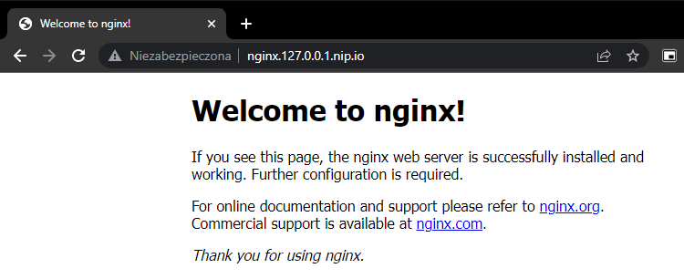

# k3d-ingress-example
This project makes it easy to create multi-node k3s cluster via [k3d](https://k3d.io/) for local development on Kubernetes.

# Prerequisites
- k3d v5.4.6
- kubectl
- docker

# Setup

## Create 3 node cluster via [k3d](https://k3d.io/)
```bash
# create cluster
k3d cluster create mycluster --agents 2 --servers 1 --k3s-arg "--disable=traefik@server:*" -p 80:80@loadbalancer -p 443:443@loadbalancer --verbose

# verify if 'k3d-mycluster' context is active
kubectl config current-context
```
This will create multiple docker containers:
- `k3d-mycluster-serverlb` - LoadBalancer created in front of the server node.
- `k3d-mycluster-agent-0` - agent node
- `k3d-mycluster-agent-1` - agent node
- `k3d-mycluster-server-0` - server node

## Deploy [NGINX Ingress Controller](https://kubernetes.github.io/ingress-nginx/)
```bash
kubectl apply -f https://raw.githubusercontent.com/kubernetes/ingress-nginx/controller-v1.4.0/deploy/static/provider/cloud/deploy.yaml
```

## Deploy nginx demo
```bash
kubectl create namespace nginx-demo
kubectl apply -f nginx-demo.yaml
```

## Verify
Check if ingress is exposed on the host system via LoadBalancer container:
```bash
$ curl -I -H "Host: nginx.127.0.0.1.nip.io" localhost
HTTP/1.1 200 OK

$ curl -I nginx.127.0.0.1.nip.io
HTTP/1.1 200 OK
```



# Clean up
```bash
k3d cluster delete mycluster
```